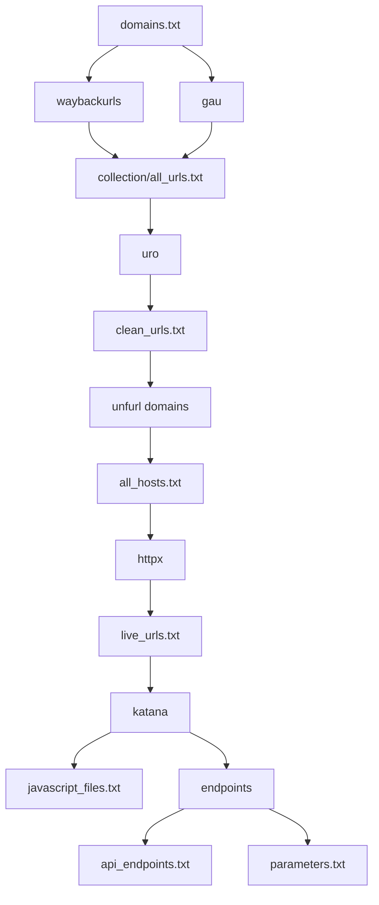

# URLHunter v2

<p align="center">

# URLHunter

### Automated Bug Bounty Reconnaissance Framework

</p>


URLHunter is an automated reconnaissance framework designed for bug bounty hunters and security researchers.

It focuses on **attack surface discovery** by collecting, organizing, and preparing targets for further security testing.

URLHunter does not attempt exploitation. It creates a clean reconnaissance database that can be used with tools like Nuclei, XSSHunter, API testing tools, and manual analysis.

---

# Features

## Passive Reconnaissance

Collects historical URLs from:

- Wayback Machine
- GAU (GetAllUrls)


## URL Processing

- URL normalization
- Deduplication
- Host extraction


## Live Asset Discovery

- Extract domains and subdomains
- Verify reachable targets using httpx


## Active Crawling

Powered by Katana:

- Endpoint discovery
- JavaScript file discovery
- Hidden resource discovery


## Endpoint Intelligence

Automatically separates:

- API endpoints
- Parameterized URLs
- Parameters


---

# Installation

## Requirements

Make sure you have:

```bash
go
git
```
Installed.

Install required tools:

```bash
go install github.com/tomnomnom/waybackurls@latest

go install github.com/lc/gau/v2/cmd/gau@latest

go install github.com/projectdiscovery/httpx/cmd/httpx@latest

go install github.com/projectdiscovery/katana/cmd/katana@latest

go install github.com/tomnomnom/uro@latest

go install github.com/tomnomnom/unfurl@latest
```

Add Go binaries to your PATH:

```bash
export PATH=$PATH:$(go env GOPATH)/bin
```

Verify installation:

```bash
waybackurls -h
gau -h
httpx -h
katana -h
uro -h
unfurl -h
```

---

# Usage

Create your target list:

```text
domains.txt
```

Example:

```text
example.com
example.org
```

Run URLHunter:

```bash
chmod +x URLHunter.sh

./URLHunter.sh domains.txt
```

---

# Workflow



---

# Recon Pipeline

```text
domains.txt
     |
     |
     +--> waybackurls
     |
     +--> gau
             |
             v
      collection/all_urls.txt
             |
             v
            uro
             |
             v
      clean_urls.txt
             |
             v
        unfurl domains
             |
             v
        all_hosts.txt
             |
             v
           httpx
             |
             v
        live_urls.txt
             |
             v
          katana
             |
             +----------------+
             |                |
             v                v
       javascript_files   endpoints
                                |
                                |
                    +-----------+-----------+
                    |                       |
                    v                       v
              api_endpoints          parameters
```

---

# Output Structure

```text
output/

├── collection/
│   ├── wayback.txt
│   ├── gau.txt
│   └── clean_urls.txt


├── hosts/
│   ├── all_hosts.txt
│   └── live_urls.txt


├── crawl/
│   ├── katana.txt
│   ├── all_crawled.txt
│   └── javascript_files.txt


├── endpoints/
│   ├── all_endpoints.txt
│   ├── api_endpoints.txt
│   ├── parameter_urls.txt
│   └── parameters.txt


└── final_urls.txt
```

---

# File Description

| File | Description |
|------|-------------|
| `wayback.txt` | Historical URLs collected from Wayback Machine |
| `gau.txt` | URLs collected using GAU |
| `clean_urls.txt` | Normalized and deduplicated URLs |
| `all_hosts.txt` | Extracted domains and subdomains |
| `live_urls.txt` | Live targets verified with httpx |
| `katana.txt` | Raw Katana crawling results |
| `all_crawled.txt` | Clean crawling database |
| `javascript_files.txt` | Discovered JavaScript files |
| `all_endpoints.txt` | Complete endpoint database |
| `api_endpoints.txt` | API-related endpoints |
| `parameter_urls.txt` | URLs containing parameters |
| `parameters.txt` | Extracted parameter names |
| `final_urls.txt` | Complete reconnaissance URL database |

---

# Next Steps

Use the generated files for deeper testing:

```text
final_urls.txt

        |
        +--> Nuclei
        |
        +--> XSS testing
        |
        +--> SSRF testing
        |
        +--> Open Redirect testing
        |
        +--> API security testing
        |
        +--> JavaScript analysis
```

---

# Author

X-ploit-666

Repository:

https://github.com/X-ploit-666/urlHunter

---

# Disclaimer

URLHunter is intended for:

- Authorized penetration testing
- Bug bounty programs
- Security research

Only test targets where you have explicit permission.